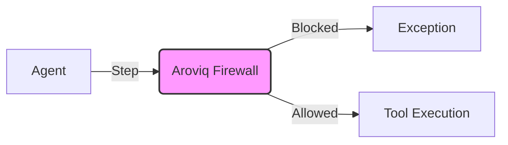

# Aroviq

> **"Don't just check the output. Verify the thought process."**

**Aroviq** is the runtime verification engine for AI agents. It intercepts reasoning steps (Thoughts) and tools (Actions) in real-time, blocking hallucinations and unsafe logic *before* they execute.



## The Why

**Problem**: Existing evaluations (DeepEval, Ragas) only check the final answer. If your agent deleted the wrong file but gave the right summary, you wouldn't know until it's too late.

**Solution**: Aroviq implements **Process-Aware Verification**. We check the *intent* using a hybrid engine (Regex Rules + LLM Judges).

| Feature | Standard Evals | Aroviq |
| :--- | :--- | :--- |
| **Check Type** | Output-only | Step-by-step |
| **Timing** | Post-hoc | Real-time |
| **Latency** | Slow | Hybrid (0ms latency) |

## The Hybrid Engine

Aroviq uses a cascading verification pipeline to balance speed and safety:

*   **Tier 0 (The Bouncer)**: Regex/Symbolic rules.
    *   **Latency**: <1ms.
    *   **Cost**: $0.
*   **Tier 1 (The Detective)**: LLM Semantic check.
    *   **Latency**: ~500ms.
    *   **Cost**: Low.


*(Tier 0 blocks threats in 0.15ms vs Tier 1 in 1200ms)*

## Installation

```bash
pip install aroviq
```

## Quick Start (The "Drop-In" Magic)

Protect your critical agent functions with a single line of code. The `@guard` decorator automatically inspects arguments and enforces safety policies.

```python
from aroviq import guard

@guard(policy="strict")
def delete_db(table_name):
    # Aroviq blocks this if the reasoning is unsafe
    print(f"Deleting {table_name}...")
```

## Features

*   **Runtime Firewall**: Block actions in flight.
*   **0ms Latency**: Tier 0 symbolic checks for instant feedback.
*   **Universal**: Works with LangChain, AutoGen, CrewAI (via decorators).
*   **Glass-Box Audit**: Full traces of *why* an action was blocked.

## Roadmap

*   **Coming Soon**:
    *   Multi-Agent Verification
    *   ReasoningBench Integration
